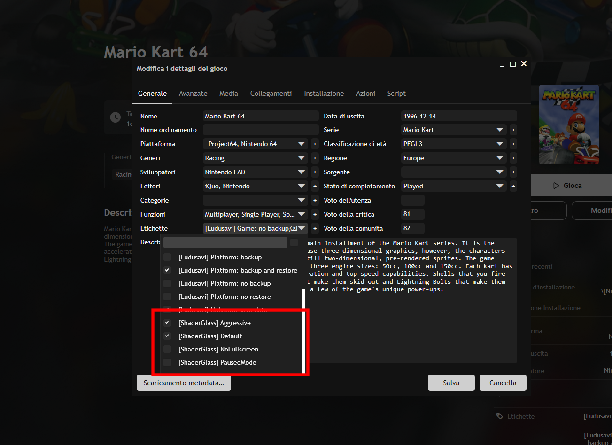

# Shader Glass Playnite Plugin

A Playnite plugin that automatically launches [ShaderGlass](https://github.com/mausimus/ShaderGlass) with custom profiles when games with specific tags are started.

## Features

- Automatically launches ShaderGlass when games with ShaderGlass tags are started
- **Automatic tag creation**: Tags are automatically created based on profiles found in your profiles directory
- Supports custom profile selection via game tags
- Configurable ShaderGlass executable path and profiles directory
- Option to ignore specific profiles from tag creation
- Easy profile refresh from Playnite menu
- Automatic cleanup when games are stopped

## Installation

You can install the plugin in several ways:

### From Playnite Extension Library (Easiest):

1. Open Playnite
2. Go to **Add-ons** → **Browse** (or **Settings** → **Add-ons** → **Browse**)
3. Search for "shaderglass" in the extension library
4. Click **Install** on the Shader Glass plugin
5. Configure the plugin in Playnite Settings → Extensions → Shader Glass

### Using the *.pext file:

You can also download the plugin from the [releases page](https://github.com/MaestroMetty/shaderglass-playnite/releases):

1. Download `shader-glass-playniteplugin-v*.pext` from the releases page
2. Drag and drop the `.pext` file into Playnite
3. Playnite will automatically install the plugin
4. Configure the plugin in Playnite Settings → Extensions → Shader Glass

### Using the *.zip file:

1. Download `shader-glass-playniteplugin-v*.zip` from the releases page
2. Extract the ZIP file into a subfolder of the Playnite extensions directory:
   - Portable installation: `%AppData%\Playnite\Extensions\ShaderGlass\`
   - Or `Extensions\ShaderGlass\` folder in your Playnite installation directory
3. Restart Playnite
4. Configure the plugin in Playnite Settings → Extensions → Shader Glass

## Configuration

### Settings

1. **ShaderGlass Executable Path**: Path to the ShaderGlass executable file (must include .exe extension)
   - Example: `C:\Program Files\ShaderGlass\ShaderGlass.exe`

2. **Profiles Directory Path**: Path to the directory containing ShaderGlass profile files (.sgp files)
   - Example: `C:\Users\YourName\AppData\Roaming\ShaderGlass\Profiles`
   - The plugin automatically scans this directory and creates tags for each profile found

3. **Ignored Profiles**: List of profile names (without .sgp extension) that should be excluded from automatic tag creation
   - Profiles listed here will not have tags created automatically
   - Useful for hiding profiles you don't want to use

### Refreshing Profiles

To refresh the list of available profiles and update the automatically created tags:

1. Go to **Extensions** → **Shader Glass** → **Refresh Profiles** in the Playnite menu, or use the refresh button in the extension settings page
2. The plugin will scan your profiles directory and create/update tags accordingly
3. Any new profiles will have tags created automatically
4. Profiles in the ignored list will be skipped

### Game Tags

The plugin automatically creates tags for each profile found in your profiles directory. Simply tag your games with these automatically created tags to enable automatic shader injection:

**Note**: Tags are automatically created based on profiles in your profiles directory. You can refresh the profile list from **Extensions** → **Shader Glass** → **Refresh Profiles** in the Playnite menu or from the extension settings page.

- **`[ShaderGlass] <profile-name>`**: Launches ShaderGlass with the specified profile in fullscreen mode
  - Example: `[ShaderGlass] CRT-Royale` will launch with `ShaderGlass.exe -f "CRT-Royale.sgp"`

- **`[ShaderGlass] NoFullscreen`**: Use this tag along with a profile tag to launch without fullscreen flag
  - Example: If a game has both `[ShaderGlass] CRT-Royale` and `[ShaderGlass] NoFullscreen`, it will launch with `ShaderGlass.exe "CRT-Royale.sgp"` (no `-f` flag)

- **`[ShaderGlass] PausedMode`**: Use this tag along with a profile tag to launch ShaderGlass in paused mode (adds `-p` flag)
  - ⚠️ **Warning**: PausedMode can lead to weird behavior in some games. Use with caution.
  - Example: If a game has both `[ShaderGlass] CRT-Royale` and `[ShaderGlass] PausedMode`, it will launch with `ShaderGlass.exe -f "CRT-Royale.sgp" -p`

### Tag Examples

- Game with fullscreen shader: Add tag `[ShaderGlass] MyProfile`
- Game with windowed shader: Add tags `[ShaderGlass] MyProfile` and `[ShaderGlass] NoFullscreen`
- Game with paused mode: Add tags `[ShaderGlass] MyProfile` and `[ShaderGlass] PausedMode`
- Game with windowed paused mode: Add tags `[ShaderGlass] MyProfile`, `[ShaderGlass] NoFullscreen`, and `[ShaderGlass] PausedMode`

## How It Works

1. When a game is started, the plugin checks if it has any `[ShaderGlass]` tags
2. If a profile name tag is found, it constructs the full path to the profile file
3. ShaderGlass is launched with the appropriate arguments:
   - With `-f` flag if no `NoFullscreen` tag is present
   - Without `-f` flag if `NoFullscreen` tag is present
   - With `-p` flag if `PausedMode` tag is present (⚠️ can cause weird behavior)
4. When the game stops, ShaderGlass is automatically closed

## Requirements

- Playnite 6.0 or later
- ShaderGlass installed on your system
- .NET Framework 4.6.2 or later

## License

Copyright © MaestroMetty 2025

## Development

If you want to contribute or build the plugin from source, see [DEVELOPMENT.md](DEVELOPMENT.md) for setup instructions.

## Support

For issues, feature requests, or questions, please open an issue on the project repository.

